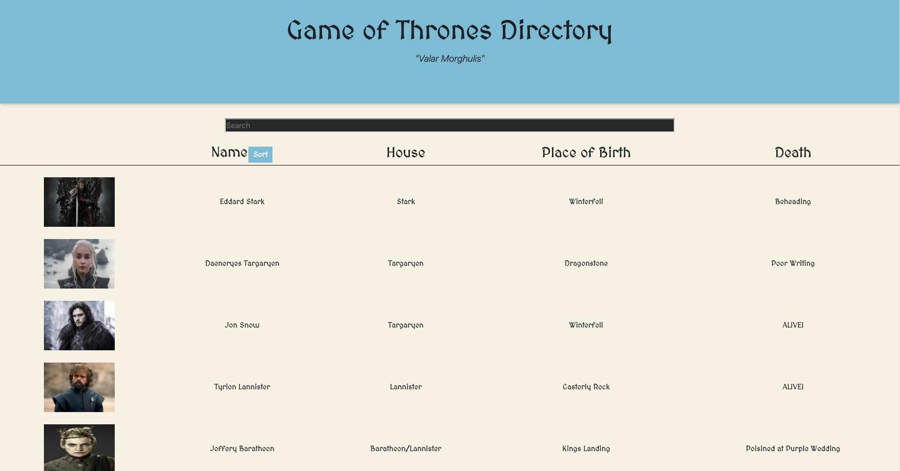

# Employee-Directory

The Game of Thrones Directory is a React application that uses HTML, CSS, Javascript, and React. This application allows users to scroll through the directory of Game of Thrones Characters. The Sort button allows users to see the directory in alphabetical order by name. The search function allows users to quickyly find GOT characters. For future development, I would make the search functions by all catagories, not just by name. I would also make the sort button alphabetically for all other catagories as well. 